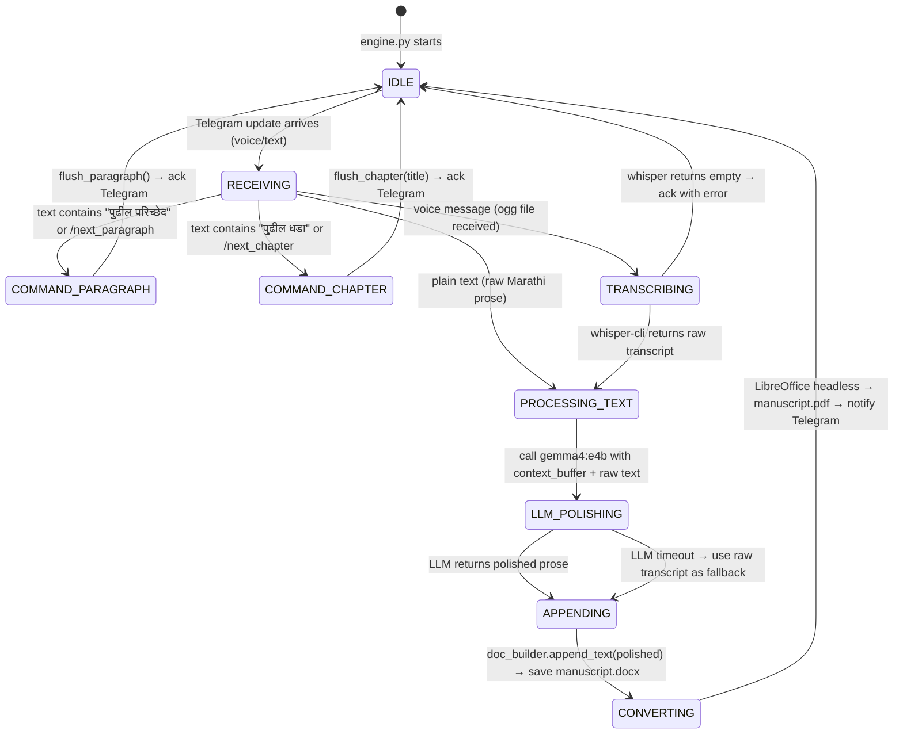

# ARVSAL Voice-to-Book Engine — Implementation Plan

## Task 1: System Analysis — Extracted Configuration Values

> [!IMPORTANT]
> All values below were extracted by scanning the live ARVSAL repository. Zero modifications were made to any existing JS file.

### Telegram Credentials (from `.env`)
| Key | Value |
|-----|-------|
| `TELEGRAM_BOT_TOKEN` | `8250519127:AAHCn1itBprNkNlyZWFw04SyyxSrjJzBsxw` |
| `TELEGRAM_CHAT_ID` | `7052720836` |

### Whisper.cpp (from `backend/whisperManager.js`)
| Key | Resolved Absolute Path |
|-----|----------------------|
| **Executable** | `C:\Users\athar\Desktop\arvsal\whisper.cpp\build\bin\whisper-cli.exe` |
| **CWD** (DLL location) | `C:\Users\athar\Desktop\arvsal\whisper.cpp\build\bin\` |
| **medium.bin model** | `C:\Users\athar\Desktop\arvsal\whisper.cpp\models\ggml-medium.bin` |
| **small.en model** | `C:\Users\athar\Desktop\arvsal\whisper.cpp\models\ggml-small.en.bin` |

> [!NOTE]
> `whisperManager.js` resolves paths relative to `__dirname` (`backend/`), so `../whisper.cpp/models/ggml-medium.bin` maps to the absolute path above. The `ggml-medium.bin` (1.53 GB) was confirmed present in the models directory.

### Ollama (from `backend/localLLM.js` commented-out legacy path + live `where ollama`)
| Key | Value |
|-----|-------|
| **Executable path** | `C:\Users\athar\AppData\Local\Programs\Ollama\ollama.exe` |
| **Active on PATH** | Yes (`ollama version 0.24.0`) |
| **Book engine model** | `gemma4:e4b` (forced, per spec) |
| **Invocation mode** | `ollama run gemma4:e4b` via stdin (matches `llmRunner.js` pattern) |

### LibreOffice Headless (system-wide scan)
| Key | Value |
|-----|-------|
| **soffice.exe** | `C:\Program Files\LibreOffice\program\soffice.exe` |
| **Headless conversion cmd** | `soffice --headless --convert-to pdf --outdir <dir> manuscript.docx` |

---

## File Directory Structure: `arvsal/book/`

```
arvsal/
└── book/
    ├── engine.py               # Main entry point & Telegram polling loop
    ├── config.py               # All paths, credentials, constants
    ├── state_machine.py        # BookSession state machine (IDLE→RECORDING→PROCESSING)
    ├── transcriber.py          # Whisper.cpp subprocess wrapper
    ├── llm_processor.py        # Ollama gemma4:e4b subprocess wrapper
    ├── doc_builder.py          # python-docx manuscript builder
    ├── converter.py            # LibreOffice headless PDF conversion
    ├── context_buffer.json     # Auto-generated: sliding window of last 5 processed lines
    ├── manuscript.docx         # Auto-generated: master running document
    ├── manuscript.pdf          # Auto-generated: re-compiled after every update
    ├── audio_tmp/              # Auto-generated: temp .ogg/.wav files from Telegram voice
    └── requirements.txt        # Python dependencies
```

---

## Task 2: Pipeline Logic & State Machine

### Command Interceptor Table

| Trigger (Marathi / slash) | Action |
|---------------------------|--------|
| `पुढील परिच्छेद` or `/next_paragraph` | Flush current block → insert paragraph break → clear context buffer |
| `पुढील धडा [Title]` or `/next_chapter [Title]` | Flush block → insert Page Break → bold Heading 1 chapter title → reset context |

### State Machine Diagram



### Data Flow: Per-Clip Processing

```
[Telegram Voice OGG]
        │
        ▼
  transcriber.py           whisper-cli.exe -m ggml-medium.bin -f clip.wav
  (ogg→wav via ffmpeg,      -l mr --no-timestamps --threads 4
   then whisper)             → raw Marathi transcript string
        │
        ▼
  context_buffer.json       Load last 3–5 lines from buffer
        │
        ▼
  llm_processor.py          Prompt: "You are a Marathi book author assistant.
                             CONTEXT (last lines):\n{context}\n\n
                             RAW TRANSCRIPT:\n{raw}\n\n
                             Rewrite the transcript as polished book prose in Marathi.
                             Maintain narrative continuity. Output ONLY the prose text."
                             → gemma4:e4b via ollama stdin
        │
        ▼
  doc_builder.py            append polished text to current paragraph block
  (python-docx)             (accumulate until paragraph command issued)
        │
        ▼
  converter.py              soffice --headless --convert-to pdf
                             → manuscript.pdf (overwrite)
        │
        ▼
  Telegram sendDocument     send updated manuscript.pdf back to authorized chat
```

### Context Buffer Schema (`context_buffer.json`)

```json
{
  "version": 1,
  "chapter": 1,
  "paragraph": 3,
  "window": [
    "पहिल्या ओळीचा मजकूर...",
    "दुसऱ्या ओळीचा मजकूर...",
    "तिसऱ्या ओळीचा मजकूर...",
    "चौथ्या ओळीचा मजकूर...",
    "पाचव्या ओळीचा मजकूर..."
  ],
  "current_paragraph_raw": "सध्याच्या परिच्छेदाचा संचयित मजकूर...",
  "last_updated": "2026-05-27T16:00:00"
}
```

### Document Formatting Rules

| Situation | python-docx Action |
|-----------|-------------------|
| Normal clip appended | `paragraph.add_run(polished_text + " ")` — space-concatenated within same paragraph object |
| `/next_paragraph` | `doc.add_paragraph("")` — new paragraph block started |
| `/next_chapter [Title]` | `doc.add_page_break()` → `doc.add_heading(title, level=1)` with bold run |
| First run / cold start | If `manuscript.docx` exists → open and append; else create fresh with title page |

### Formatting Philosophy

- A **single paragraph block** accumulates multiple voice clips (space-separated prose, not newline-separated).
- Only `/next_paragraph` or the Marathi command starts a new paragraph.
- Chapters always begin on a new physical page.
- No timestamp, no speaker labels — pure prose.

### Telegram Polling Loop (engine.py)

```python
POLL_INTERVAL_SEC = 2   # long-poll timeout = 30s
AUTHORIZED_CHAT_IDS = ["7052720836"]  # from .env

while True:
    updates = bot.get_updates(offset=last_update_id + 1, timeout=30)
    for update in updates:
        chat_id = str(update.message.chat.id)
        if chat_id not in AUTHORIZED_CHAT_IDS:
            continue   # silently ignore unauthorized senders
        
        if update.message.voice:
            handle_voice(update)
        elif update.message.text:
            handle_text(update)
        
        last_update_id = update.update_id
    
    save_offset(last_update_id)   # persist across restarts
```

### Audio Handling: OGG → WAV

Telegram voice messages are `.oga`/`.ogg` (Opus encoded). ffmpeg converts to 16kHz mono WAV before whisper ingestion:

```bash
ffmpeg -i input.ogg -ar 16000 -ac 1 -c:a pcm_s16le output.wav
```

ffmpeg must be available on PATH. The book engine will check for it at startup.

### LLM Prompt Engineering

```
SYSTEM: You are a literary assistant helping compose a Marathi book. 
        Your sole task is to take raw voice transcript and refine it 
        into fluent, literary Marathi prose. Preserve meaning strictly.
        Do NOT add information not present in the transcript.
        Do NOT use English words unless they appeared in the transcript.
        Output ONLY the refined prose with no preamble or explanation.

CONTEXT (last {N} accepted lines for tone continuity):
{context_window}

RAW VOICE TRANSCRIPT:
{raw_text}

REFINED PROSE:
```

### Dependency List (`requirements.txt`)

```
python-docx>=1.1.0
requests>=2.31.0
python-dotenv>=1.0.0
```

> [!NOTE]
> ffmpeg must be installed system-wide. All other heavy dependencies (whisper-cli, ollama, soffice) are reused from the existing ARVSAL installation — no reinstallation needed.

---

## Implementation Order

1. `requirements.txt` — declare Python deps
2. `config.py` — all constants, path resolution, .env loading
3. `transcriber.py` — whisper subprocess wrapper
4. `llm_processor.py` — ollama subprocess wrapper + prompt builder
5. `doc_builder.py` — python-docx append/heading/break logic
6. `converter.py` — soffice headless conversion
7. `state_machine.py` — `BookSession` class tying all modules together
8. `engine.py` — Telegram polling loop, router, startup checks

---

## Safety Guarantees

- The book engine **never imports, requires, or modifies** any file outside `arvsal/book/`.
- `.env` is read using `python-dotenv` with `dotenv_path` pointing to `../arvsal/.env` — purely read-only.
- `manuscript.docx` is opened with `python-docx` and saved back atomically (write to `.tmp` then `os.replace`).
- All audio temp files are cleaned up after successful transcription.
